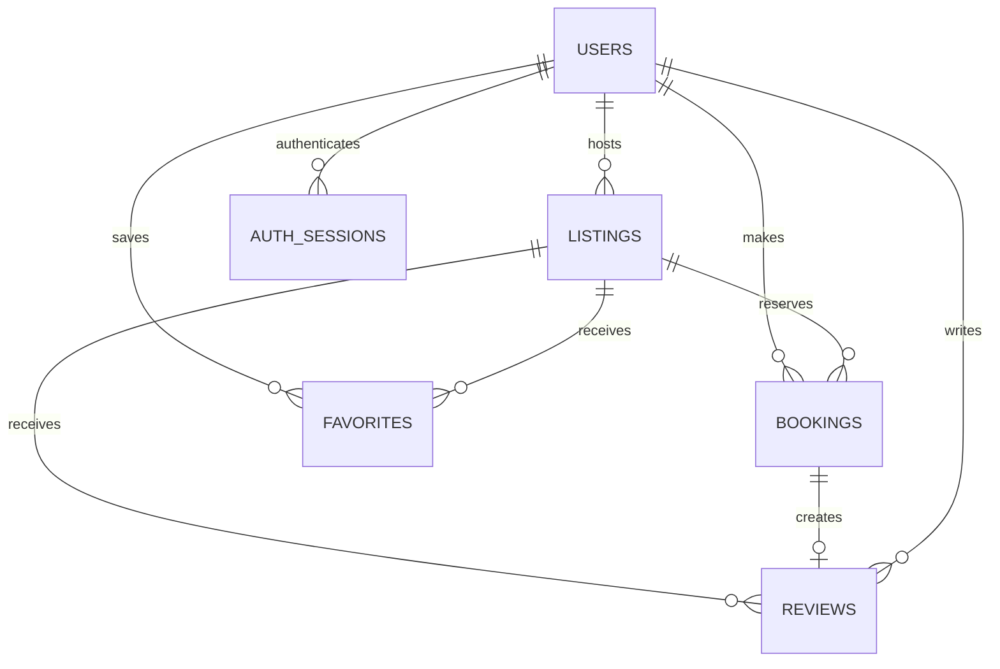

# Roamly Stays

A full-stack, Airbnb-inspired marketplace for discovering and booking distinctive stays. The project implements the complete guest and host workflow with a Next.js frontend, FastAPI API, and persisted SQLite data.

## Features

- Photo-forward explore grid with destination search, guests, categories, property type, price filtering, and pagination
- Listing galleries, host details, amenities, reviews, location preview, availability, and live price breakdowns
- Transactional booking validation that prevents overlaps, supports adjacent stays, and snapshots prices
- Mock checkout confirmation and persisted My Trips view
- Persisted wishlists
- Host dashboard with listing create, edit, soft delete, reservation, and revenue views
- Interactive OpenStreetMap with price pins, hover synchronization, viewport-aware API searches, and mobile list/map switching
- Completed-stay reviews with one-review-per-booking validation, live rating aggregation, and recalculated Superhost status
- Signed multi-image uploads to Cloudinary, with URL entry retained as a local-development fallback
- Persisted light/dark mode and responsive layouts for phone, tablet, and desktop
- Email OTP sign-in with SMTP delivery, hashed expiring codes, rate limiting, verified users, and revocable sessions
- Toast feedback and complete empty/loading states
- 24 realistic seeded listings with database-backed hosts, reviews, ratings, and availability

## Stack

- Frontend: Next.js 15 App Router, React 19, TypeScript, Lucide icons, React Hot Toast
- Backend: Python 3.12, FastAPI, Pydantic
- Database: SQLite using Python's standard `sqlite3` driver
- Testing: Pytest and FastAPI TestClient

## Run locally

### Backend

```powershell
cd backend
python -m pip install -r requirements.txt
python -m uvicorn backend.main:app --reload --port 8000 --app-dir ..
```

API docs are available at `http://localhost:8000/docs`.

Schema compatibility migrations and seed data run automatically at API startup. To run the seed explicitly:

```powershell
python -c "from backend.app.db.seed import initialize_database; initialize_database()"
```

### Frontend

In another terminal:

```powershell
cd frontend
npm install
npm run dev
```

Open `http://localhost:3000`. Set `NEXT_PUBLIC_API_URL` when the API is hosted anywhere other than `http://localhost:8000`.

### Optional Cloudinary uploads

Copy `backend/.env.example` to `backend/.env` and provide these values to enable direct cloud image uploads from the host form:

```text
CLOUDINARY_CLOUD_NAME=your-cloud-name
CLOUDINARY_API_KEY=your-api-key
CLOUDINARY_API_SECRET=your-api-secret
```

The API secret never reaches the browser. FastAPI signs a short-lived upload request and the frontend sends the image directly to Cloudinary. Without these variables, hosts can still provide image URLs.

### Email verification setup

Create `backend/.env` from `backend/.env.example`, then configure your email provider:

```text
AUTH_OTP_SECRET=replace-with-a-long-random-secret
SMTP_HOST=your-smtp-host
SMTP_PORT=587
SMTP_USERNAME=your-smtp-username
SMTP_PASSWORD=your-smtp-password-or-app-password
SMTP_FROM_EMAIL=bookings@example.com
SMTP_USE_TLS=true
SMTP_USE_SSL=false
```

Use credentials intended for SMTP/API access rather than a normal account password. The API returns `503` when delivery is not configured; it never exposes the verification code in a response or log. Codes expire after 10 minutes, allow five attempts, and requests are limited to three per email in ten minutes.

## Architecture

The codebase uses feature and responsibility boundaries so UI or business rules can change without editing unrelated layers.

### Backend

```text
backend/app/
  api/routes/       # HTTP endpoints only
  core/             # environment and application configuration
  db/               # connection lifecycle, schema, migrations, seed data, serializers
  repositories/     # SQLite queries and persistence operations
  schemas/          # Pydantic request/response contracts
  services/         # booking, review, listing, upload, favorite, and host business rules
  main.py            # FastAPI application factory
```

Routers translate HTTP input, services enforce business rules, and repositories own SQL. Booking creation uses `BEGIN IMMEDIATE`, rechecks date overlap while holding SQLite's write lock, and only then inserts the reservation. Simultaneous requests for the same dates therefore produce one `201` and one `409`.

The listing search endpoint uses one SQL statement with grouped review aggregation and a favorite lookup. It does not execute a separate host/review query for every listing card.

### Frontend

```text
frontend/
  app/               # thin Next.js route entries and global layout
  features/          # explore, listing, booking, trip, wishlist, host domains
  shared/api/        # HTTP client and normalized API errors
  shared/config/     # runtime configuration
  shared/types/      # cross-feature domain contracts
  shared/ui/         # navigation and reusable application UI
```

Each resource has a typed API module. Pages compose feature components; they do not own transport details. Host form mapping is isolated from dashboard rendering, which makes adding fields or changing API payloads localized.

The UI uses Alex Morgan (user 1) as the mocked account. The account begins as a guest and is promoted to a host in both SQLite and the global frontend state after publishing its first listing. Payments are intentionally mocked; reservation confirmation represents a successful checkout.

## Database schema

- `users`: guest/host profiles, verified email identity, provider, login metadata, and Superhost status
- `email_verification_codes`: hashed, expiring, single-use email challenges with attempt tracking
- `auth_sessions`: hashed, revocable 30-day session tokens
- `listings`: property content, pricing, capacity, coordinates, amenities/image JSON, and `is_active` for soft deletion
- `bookings`: unique UUID confirmation reference, listing/guest relation, half-open date range (`check_in` inclusive, `check_out` exclusive), immutable price/fee/total snapshots, and status
- `favorites`: composite-key user/listing relation
- `reviews`: booking-linked review content, guest ownership, ratings, and timestamps

Foreign keys enforce ownership relationships. Host deletion actions set `listings.is_active = 0`; search and new bookings exclude inactive inventory, while direct listing detail and historical trip joins remain available. `idx_bookings_dates` supports availability checks.



## Tests

```powershell
python -m pytest backend -q
cd frontend
npm run build
```

The backend suite covers adjacent stays, overlap rejection, simultaneous booking attempts, invalid and past dates, malformed payloads, price snapshots, soft deletion, review aggregation, date-aware availability, pagination stability, filters, and host CRUD.

## Deployment

### Backend on Render

The repository includes `render.yaml`. Create a Render Blueprint from the repository root. When prompted, provide `ROAMLY_CORS_ORIGINS` plus the SMTP host, username, password, and sender address used for email login. The CORS value must be the exact frontend origin, without a trailing slash, for example:

```text
https://roamly-stays.vercel.app
```

The Blueprint uses these production settings:

- Build: `pip install -r backend/requirements.txt`
- Start: `uvicorn backend.app.main:app --host 0.0.0.0 --port $PORT`
- Health check: `/health`
- Python: `3.12.11`
- SQLite: `/var/data/stays.db` on a 1 GB persistent disk
- Authentication: a generated `AUTH_OTP_SECRET` and SMTP credentials supplied as secret environment variables

The persistent disk requires a compatible paid Render service. A free service with an ephemeral filesystem can demonstrate the UI, but bookings, favorites, users, and host listings can reset after a restart and therefore do not satisfy the assignment's persistence requirement.

### Frontend on Vercel

Import the same repository as a Vercel project and set **Root Directory** to `frontend`. Add this environment variable for Production, using the deployed Render API URL without a trailing slash:

```text
NEXT_PUBLIC_API_URL=https://roamly-api.onrender.com
```

Deploy the frontend, then confirm the final Vercel origin is present in Render's `ROAMLY_CORS_ORIGINS` and restart the backend if you changed it. Rebuild the frontend whenever `NEXT_PUBLIC_API_URL` changes because public Next.js values are embedded into the client bundle.

To use Vercel Preview deployments against the same backend, add the preview/custom preview origin to the comma-separated `ROAMLY_CORS_ORIGINS` value and configure `NEXT_PUBLIC_API_URL` for Vercel's Preview environment as well.

After deployment, verify:

1. `https://<render-service>/health` returns `{"status":"ok"}`.
2. The Vercel home page loads listing data rather than an empty/error state.
3. A booking remains visible in My Trips after restarting the Render service.
4. Browser developer tools show no CORS errors and no requests to `localhost`.

## Trade-offs & Assumptions

- Currency is displayed in USD for the demo.
- A booking's checkout date can equal another booking's check-in date.
- Each booking stores `price_per_night`, cleaning/service fee snapshots, and `total_price`; later listing edits never change historical costs.
- SQLite `BEGIN IMMEDIATE` is appropriate for this single-database assignment. A horizontally scaled production system should use PostgreSQL row/advisory locking or an exclusion constraint.
- Listing removal is a soft delete so previous guests retain working trip-detail links.
- Cloudinary is optional in local development; image URL entry remains available when credentials are not configured.
- Email login requires SMTP credentials. Google login remains mocked because OAuth client credentials and callback domains are deployment-specific.
- Broken image URLs render a local placeholder UI.
- Existing seeded dates demonstrate unavailable inventory; all other future dates can be booked.
- Messaging, identity verification, and real payments are intentionally mocked. Map tiles use OpenStreetMap and require network access in the browser.
